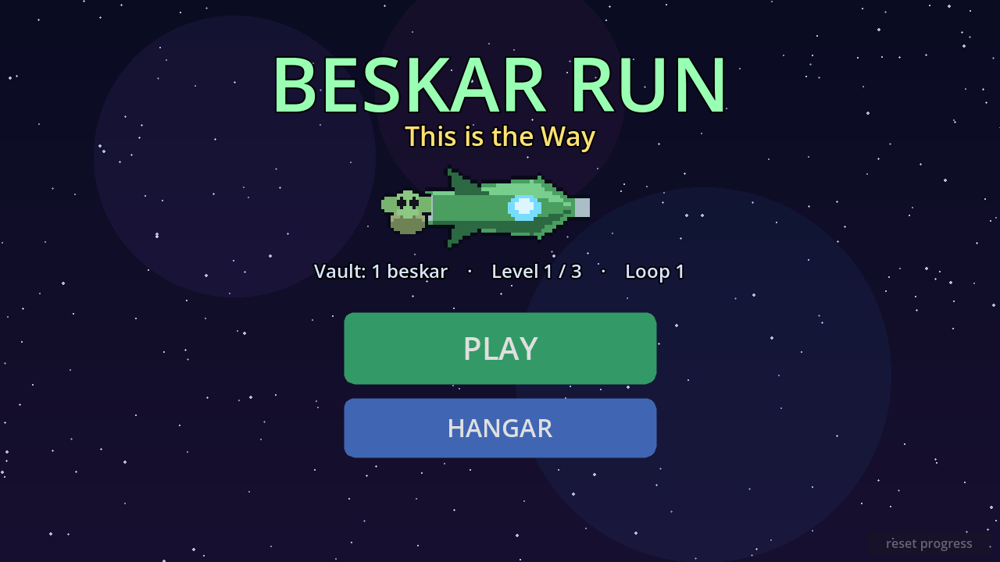

# Beskar Run — "This is the Way"

A snackable, kid-friendly side-scrolling **rocket shooter** for Android phones,
built in **Godot 4.6 (GDScript)**. Pilot a green beskar gunship with a tiny
companion, blast Imperial-style waves, and beat a boss per level. Bright, chunky
pixel-art arcade fun in ten seconds.

> Themed (not licensed) after a Mandalorian/Grogu vibe. All art and sound are
> generated procedurally by this repo — see `tools/gen_assets.py`.



## Play

- **Fly** with the floating virtual joystick (left thumb). The ship **auto-fires**.
- **SWAP** (right) cycles your owned weapons mid-run.
- **FORCE** (right) triggers Grogu's Force Wipe (once unlocked in the hangar).
- **II** (top-right) pauses.
- Desktop testing: WASD to move, `Q` swap weapon, `E` force, `Esc` pause.

Clear timed waves → a boss flies in → beat it to finish the level. Beskar (gold)
banks to your vault; spend it in the **Hangar** on weapons, ship upgrades and
Grogu's Gifts, then relaunch stronger. After the last level the campaign **loops
harder**.

## Content

- **3 levels**, each a distinct place with layered parallax depth and its own
  boss: Asteroid Field → *Mining Hauler* (spray), Imperial Fleet → *Imperial
  Cruiser* (aimed), Planet Surface → *Imperial Walker* (bursts).
- **9 weapons**: Blaster, Twin Cannon, Spread Shot, Scatter Gun, Vulcan, Homing
  Missiles, Laser Lance, + premium Beskar Storm & Darksaber Array.
- **3 ship upgrades**: Fire Rate, Beskar Armor (hearts), Thrusters (speed).
- **5 Grogu's Gifts**: Beskar Magnet, Force Wipe, Force Mend, Lucky Frog, Force
  Bond (revive). All progress saves to local device storage (`user://`).

## Project layout

```
project.godot            # landscape, mobile GL-compat, autoloads, input map
scenes/                  # entry scenes (thin: a root node + script)
  Game.tscn              # the run; builds the world in code
  ui/{Title,HUD,Hangar,ResultScreen}.tscn
scripts/
  autoload/{Defs,GameData,Events,Audio}.gd   # data, save/economy, signal bus, sfx
  entities/{Player,Enemy,Boss,Projectile,EnemyBullet,Beskar,Explosion}.gd
  game/{Game,Background}.gd                   # wave/boss orchestration, parallax
  ui/{Title,HUD,Hangar,ResultScreen,VirtualJoystick,TouchButton}.gd
assets/                  # generated sprites, backgrounds, sfx, app icon
tools/gen_assets.py      # regenerates all art + sound (PIL + stdlib wave)
tools/TestEconomy.tscn   # headless self-test of save/economy logic
android/                 # installed Godot Android build template (gradle)
```

Most nodes are built in code (entities use `class_name` + `.new()`), so the only
`.tscn` files are thin entry scenes.

## Run from source

```bash
godot --import                 # first time: import assets
godot                          # launches the Title scene
```

Regenerate assets (optional):

```bash
python3 -m venv .venv && .venv/bin/pip install Pillow
.venv/bin/python tools/gen_assets.py
```

Run the logic self-test:

```bash
godot --headless res://tools/TestEconomy.tscn   # prints PASS/FAIL, exit code = failures
```

## Build the Android APK

Tooling required (macOS example):

- Godot **4.6.3** + matching **export templates** (4.6.3.stable).
- **JDK 17** — *not* a newer JDK. Gradle 8.11 (shipped with the template) rejects
  Java 24/25 with `Unsupported class file major version`. Point Godot at it via
  *Editor Settings → Export → Android → Java SDK Path*.
- Android SDK with **platform-tools**, **platforms;android-36**, and
  **build-tools;36.1.0** (Godot 4.6.3's target SDK is 36).
- A debug keystore (`debug.keystore`, alias `androiddebugkey`, pass `android`).

Project gotchas already configured here:

- `rendering/textures/vram_compression/import_etc2_astc=true` in `project.godot`
  — **required for Android export**; without it the export aborts with an empty
  "configuration errors" message.
- `android/.gdignore` keeps the editor from importing the gradle template's
  resources (otherwise `.import` sidecars break `mergeResources`).
- `android/.build_version` marks the installed build template version.

Then:

```bash
godot --headless --export-debug "Android" build/beskar_run.apk
adb install -r build/beskar_run.apk      # install on a device
```

The result is a landscape phone APK: `com.beskarrun.game`, minSdk 24,
targetSdk 36, arm64-v8a, debug-signed and installable. Swap `--export-debug` for
`--export-release` (with a release keystore) to ship.
